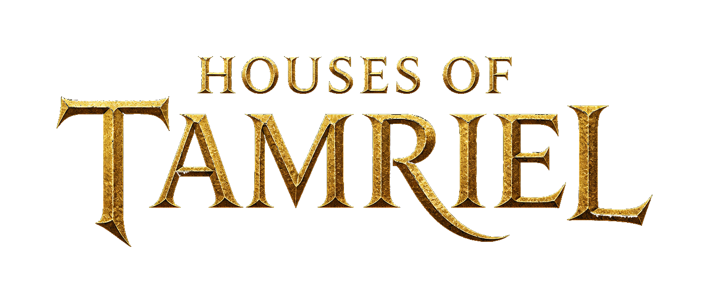

  

**0.0.2**

Houses of Tamriel is one persistent Morrowind world. Towns, guilds, and offices belong to players.
There is one server at this time.

You need Morrowind GOTY. The launcher installs everything else. Character creation happens in the game, not in the launcher.

## Play

1. **Familiarize yourself with the rules.** This is for your own good once you start.
2. **Install Morrowind.** The GOTY Steam edition is preferred.
3. **Join [Discord](https://discord.gg/PbW5BGyK7g)** and finish onboarding so you have the **Approved** rank. If you are already in the server, good — you still need Approved before Play.
4. **Download the [Launcher](https://github.com/KaelKodes/HoT/releases).**
5. **Select the server and Update.**
6. **Verify with the Houses of Tamriel bot.** Play shows a code. DM that code to the bot (or use `/login`) for the final handshake.
7. **Make your character.**
8. **Enjoy, and good luck.**
